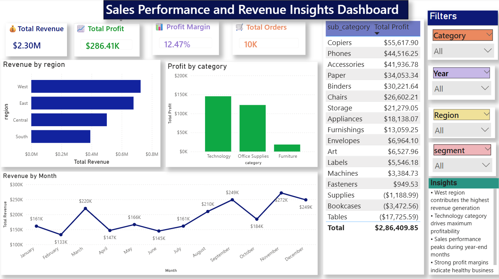

# Sales Performance and Revenue Insights Dashboard using Power BI and SQL

## Project Overview
Developed an interactive sales analytics dashboard to analyze revenue, profit, customer trends, and regional sales performance using SQL, Excel, and Power BI.

## Business Problem
Organizations require data-driven insights to monitor sales performance, identify profit-driving products, and improve business decision-making.

## Tools & Technologies
- Power BI
- SQL
- Advanced Excel
- KPI Reporting
- Data Visualization

## Key KPIs
- Total Revenue
- Total Profit
- Profit Margin
- Total Orders
- Top Performing Regions
- Loss-Making Categories

## Dashboard Features
- KPI Cards
- Regional Sales Analysis
- Product Category Insights
- Revenue & Profit Trends
- Interactive Filters & Slicers

## Key Insights
- Certain product categories generated high revenue but low profit
- Regional sales trends identified top-performing markets
- Loss-making categories impacted overall profitability
- Sales performance varied significantly across customer segments

## Business Recommendations
- Focus marketing on profitable categories
- Reduce losses from underperforming products
- Optimize inventory based on regional demand
- Improve pricing strategies for low-margin products

## Project Outcome
Delivered actionable business insights through dashboards and analytical reporting to support strategic sales decision-making.

## Dashboard Preview

